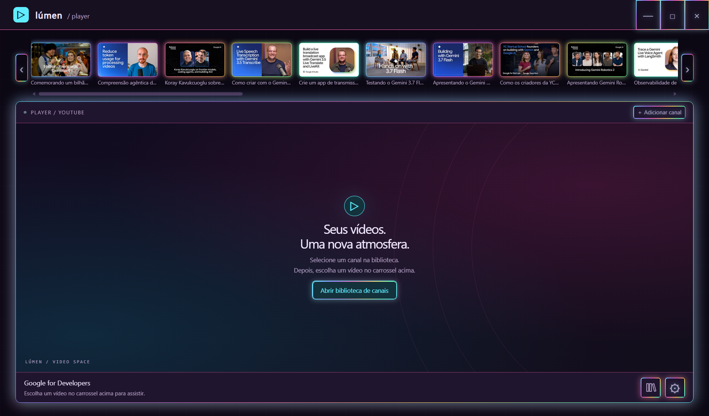
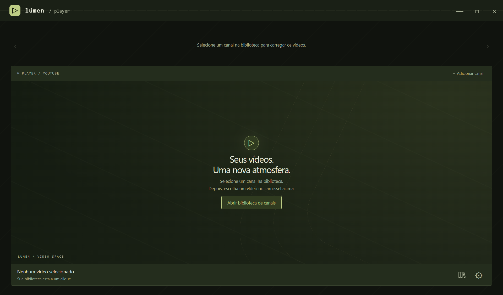
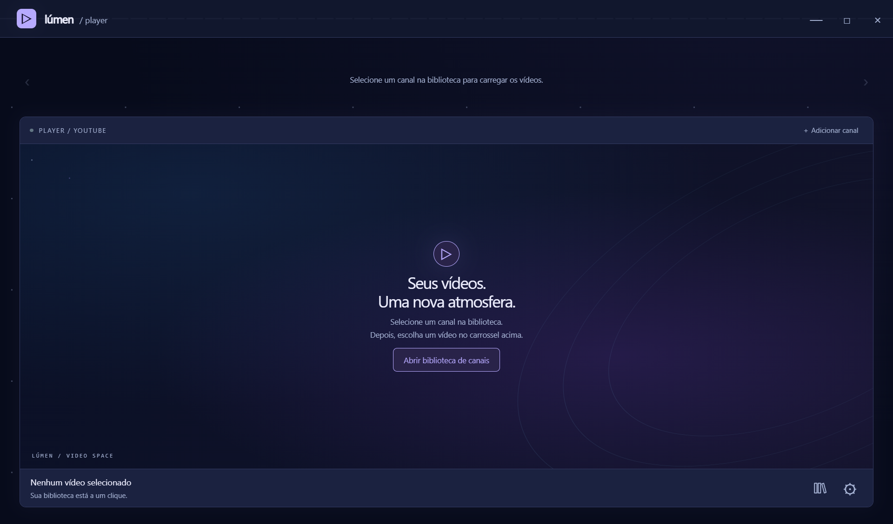

# RKD Player Module

<p align="center">
  <strong>Your videos. Your atmosphere.</strong><br>
  A desktop YouTube player with a local library, channel recommendations, dark themes, and audio-reactive visuals.
</p>

<p align="center">
  
  
  
  
</p>

<p align="center">
  
  
  
</p>

## ✨ About the project

**RKD Player Module** (`rkd-player-module`) brings YouTube playback, saved channels, and a customizable desktop experience into one window.

The player opens in a spacious Cinema layout. A modal library keeps your YouTube channels organized. Selecting a channel loads its public videos into the horizontal thumbnail carousel without starting playback. Choose a carousel thumbnail when you are ready to watch. Four dark themes and four audio visualizers let you personalize the interface without restarting playback.

Built with Electron, vanilla JavaScript, HTML, and CSS. The desktop interface currently uses the **Lúmen** name and Portuguese labels.

## 📚 Table of contents

- [Technologies](#-technologies)
- [Features](#-features)
- [Theme gallery](#-theme-gallery)
- [Project structure](#-project-structure)
- [Getting started](#-getting-started)
- [Player controls](#-player-controls)
- [Settings and storage](#-settings-and-storage)
- [Development and tests](#-development-and-tests)
- [Troubleshooting and limitations](#-troubleshooting-and-limitations)
- [License](#-license)

## 🛠 Technologies

| Technology | Purpose |
| --- | --- |
| Electron 44.3.0 | Desktop window, IPC, native opacity, and app-window audio capture |
| Node.js ≥ 22.12.0 | Runtime, local HTTP servers, metadata requests, and file storage |
| JavaScript, HTML & CSS | Interface, dialogs, carousel, and theme system |
| YouTube IFrame Player API | Embedded video playback and player state events |
| Web Audio API | Live frequency and waveform analysis |
| Canvas 2D | Audio visualizer rendering across the title bar |
| JSON | Saved links and persistent preferences |
| Playwright 1.63.0 | Electron interaction and live playback checks |
| Node.js test runner | URL validation, storage, migration, and recommendation tests |

## 🚀 Features

### Cinema and recommendations

- Watch videos in an expanded player with YouTube's native playback controls.
- Browse a random selection of public videos from the channel selected in your library.
- Scroll the carousel with its arrows, the mouse wheel, or horizontal touchpad gestures.
- Start playback by selecting a carousel thumbnail. Videos are never added to the channel library.
- Fetch channel recommendations without configuring a YouTube Data API key.
- Refresh the carousel after every video selection, excluding the playing video and favoring suggestions outside the previous batch.
- Gradually expand the candidate pool with recent uploads and the channel's public **Oldest** section, following available pagination.
- Keep up to 360 candidates per channel for five minutes, and shuffle a new batch of up to 16 videos on each request. Caching never freezes the displayed order.

Recommendations come from public channel feeds and channel pages, including the continuations exposed by the Videos and Oldest sections. If older uploads cannot be fetched, the player keeps shuffling available videos. Small channels can repeat suggestions; this is a sample of accessible uploads, not a uniform random search across the entire channel history. They are **channel-based suggestions**, not personalized recommendations from a signed-in account.

### Modal library

- Save YouTube **channel links** with the name retrieved automatically from YouTube.
- Use each channel's banner as its library card background, darkened for readability. Existing channels fetch their banners automatically; missing or unavailable images fall back to the theme background.
- Accept `youtube.com/@handle`, `/channel/UC…`, `/c/name`, and `/user/name`, including links to their Videos tab.
- Resolve aliases to a canonical channel ID to prevent duplicate channels.
- Show each channel's profile photo, with an initial as fallback. Photos are fetched for visible library cards, saved locally as URLs, and refreshed after a day. Existing channels are updated automatically.
- Display the channel's public subscriber count below its name, using YouTube's abbreviated format. Existing channels update automatically; unavailable counts use a placeholder instead of a guessed number. Profile data refreshes after a day.
- Search saved channels and remove them using the trash icon.
- Select a channel to close the modal and populate its carousel, without autoplay.
- Browsing another channel updates only the carousel. The current video and audio continue uninterrupted until you choose another thumbnail.
- Keep the player's dimensions unchanged while browsing the library.
- Display loading, empty-channel, and retry states. Late responses cannot replace a newly selected channel.

Older video libraries are converted to unique channels in the background. Unresolved video records remain in `legacyVideos` in the data file, and the library offers **Tentar converter novamente**. Preferences and custom names of existing channels are preserved.

### Watch history

- Open **Histórico** beside Library and Settings to see thumbnails and titles for your 100 most recently watched videos.
- Click a history entry to close the modal, play that video, and load a new random selection from its channel into the carousel. This also works for channels outside your saved library. A failed channel lookup can be retried without interrupting playback.
- Update the list automatically when playback starts, with the newest video first. Watching a video again moves it to the top without duplicates.
- Use the thumbs-up above the player to like or unlike a watched video. Liked entries show **Curtido** in history. This local preference persists across restarts and replays while the video remains in the latest 100 entries; it does not send a like to your YouTube account.
- Keep history across app restarts. Browsing channels, unsuccessful playback attempts, and the ISS background do not add entries.
- Start collecting history from this version onward; earlier viewing sessions cannot be recovered.

### Themes and window transparency

| Theme | Visual identity |
| --- | --- |
| **Cyberpunk** | Multicolor neon gradients in cyan, violet, pink, yellow, and green around carousel thumbnails, buttons, and the video panel, deep purple surfaces, and a subtle grid |
| **Radar** | Olive green, khaki accents, and angular details |
| **Estação Espacial** | Deep blue, violet accents, stars, and orbital patterns |

Theme changes apply immediately to the interface, dialogs, and visualizer palette. Native window transparency ranges from **0% to 65%** and affects the entire application, including the video.

Selecting a theme applies these presets every time:

| Theme | Video tint | Audio visualizer | Transparency |
| --- | --- | --- | --- |
| **Radar** | Yellow | Waves | 0% |
| **Estação Espacial** | Blue | Aurora | 8% |
| **Cyberpunk** | Pink | Matriz LED | 8% |

You can freely adjust these values afterward. Manual adjustments survive app restarts; selecting a theme again reapplies its preset. The visualizer's enabled/disabled setting remains under your control.

The **Estação Espacial** theme adds [Sen's ISS livestream](https://www.youtube.com/watch?v=fO9e9jnhYK8) behind the carousel and main video panel. Opening Settings, Library, History, or Add Channel moves that same background player into the modal without restarting it; closing the modal returns it to the underlying library or main screen. This separate embedded player stays muted, with a dark overlay for readability; your selected video retains its own audio and controls. The background unloads when minimized or when switching themes, then reconnects when you return. If loading fails or buffering lasts 25 seconds, the theme background returns and the app retries after 60 seconds (or when the connection returns). The broadcast depends on the provider's availability and uses additional bandwidth and GPU resources.

### Radar flight-map background

The **Radar** theme displays real aircraft positions from the [OpenSky Network API](https://openskynetwork.github.io/opensky-api/rest.html) on a green map behind the player and inside Library, Settings, History, and Add Channel. On Windows, it automatically centers a 4° latitude × 6° longitude region around your device location. No API key is required for anonymous access. This is a custom map powered by OpenSky; it does not embed Flightradar24.

Location uses Windows' location service through a hidden, time-limited Windows PowerShell helper. It respects denied access and does not change Windows permissions. Location is requested automatically when the application starts with Radar selected, or when you select Radar. Flight polling and restoring a minimized window reuse that position; there are no manual location controls. Coordinates are rounded to two decimal places, held only in memory, and used to request the regional bounds from OpenSky. No location is stored in the library or sent to an IP-geolocation service. If location is unavailable or denied, the radar uses the default São Paulo/Rio region until the next Radar selection or application restart.

Positions refresh every **60 seconds** while the Radar theme is visible. Aircraft use reported coordinates and headings; the rotating radar sweep is decorative. The interface has no region or flight-count information panel. Missing or stale positions are omitted; unavailable data or quota exhaustion clears the aircraft while the map remains visible. Switching themes or minimizing pauses requests and rendering. Positions stay in memory and are never written to the library or watch history.

OpenSky currently allows 400 anonymous credits per day, shared by public IP. This region costs one credit per query; at one query per minute, the quota supports about 6 hours and 40 minutes of continuous use if no other app shares it. The player respects the API's retry interval after rate limiting. Coverage and availability depend on OpenSky's receivers and service.

The bundled basemap contains [Natural Earth's worldwide country boundaries](https://github.com/nvkelso/natural-earth-vector/blob/master/geojson/ne_110m_admin_0_countries.geojson), provided in the [public domain](https://www.naturalearthdata.com/about/terms-of-use/). No map-tile service or additional credentials are needed.

### Live audio visualizers

| Style | Reacts with |
| --- | --- |
| **Barras** | A spectrum of frequency bars |
| **Ondas** | An audio waveform |
| **Aurora** | Translucent ribbons shaped by frequency bands |
| **DNA** | A double helix that expands and rotates with the audio |
| **Constelação** | Connected stars whose light and motion follow the sound |
| **Matriz LED** | Segmented frequency columns inspired by LED equalizers |

The visualizer spans the **entire title bar**, behind the Lúmen branding and window controls, with **70% fixed transparency** of its own.

Audio analysis uses the live sound of the application's own window. It does not record audio, use the microphone, or capture other applications. Visuals become still when there is no sound; changing styles reuses the active capture. Disabling the visualizer releases its capture resources.

## 🎨 Theme gallery

Screenshots of the desktop interface with no video selected. Click a preview to inspect the theme.

| Cyberpunk | Radar | Estação Espacial |
| :---: | :---: | :---: |
| [](docs/images/cyberpunk.png) | [](docs/images/military.png) | [](docs/images/space.png) |

## 📁 Project structure

```text
rkd-player-module/
├── docs/
│   └── images/                  # README theme previews
├── scripts/
│   ├── start.cjs                # Electron launcher
│   ├── test-app.cjs             # Library, themes, settings, and persistence
│   ├── test-channels.cjs        # Channel switching, retries, and no autoplay
│   ├── test-history.cjs         # Playback history, modal updates, and persistence
│   ├── test-radar.cjs           # Live aircraft positions and background lifecycle
│   ├── test-youtube.cjs         # Live playback and minimize behavior
│   ├── test-recommendations.cjs # Channel suggestions and carousel
│   └── test-visualizer.cjs      # Live audio capture and visualizer lifecycle
├── src/
│   ├── main.cjs                 # Native window and validated IPC handlers
│   ├── preload.cjs              # Restricted renderer bridge
│   ├── core.cjs                 # URL validation and JSON persistence
│   ├── history.cjs              # Validated, deduplicated 100-video watch history
│   ├── radar.cjs                # OpenSky positions, caching, and quota handling
│   ├── migration.cjs            # Convert legacy video links to channels
│   ├── recommendations.cjs      # Channel lookup, parsing, and cache
│   ├── recommendation-catalog.cjs # Older uploads, pagination, and random selection
│   ├── server.cjs               # Isolated local interface/player origins
│   └── ui/
│       ├── index.html           # Desktop interface and modals
│       ├── app.js               # Library, settings, and player coordination
│       ├── style.css            # Layout and original theme
│       ├── themes.css           # Cyberpunk, Radar, and Estação Espacial themes
│       ├── radar-background.js  # Radar flight-map Canvas renderer
│       ├── radar-map.json       # Natural Earth worldwide boundaries
│       ├── player.html          # Isolated YouTube wrapper
│       ├── player.js            # YouTube API integration
│       └── visualizer.js        # Audio capture, analysis, and Canvas rendering
├── tests/
│   ├── core.test.cjs
│   ├── history.test.cjs
│   ├── recommendations.test.cjs
│   ├── recommendation-catalog.test.cjs
│   └── migration.test.cjs
├── .gitignore
├── package.json
├── package-lock.json
└── README.md
```

The Electron renderer runs with **context isolation**, **sandboxing**, and **Node.js integration disabled**. The YouTube wrapper uses a separate loopback origin without the Electron bridge. Local servers bind to `127.0.0.1` on available ports; they are internal application components, not a public REST API.

## 🧭 Getting started

### Prerequisites

- Windows 10 or 11; other platforms have not been validated.
- Node.js **22.12.0 or newer**, with npm. Node.js 24 is a suitable choice.
- Internet access to install dependencies and load YouTube videos, metadata, and thumbnails.

### Install and run

After cloning or downloading this repository, open a terminal in the project root:

```bash
npm ci
npm start
```

`npm ci` installs the versions recorded in `package-lock.json`. The start command launches Electron and the internal local servers. No separate database or frontend build step is required.

If PowerShell blocks `npm.ps1`, use:

```powershell
npm.cmd ci
npm.cmd start
```

The repository currently provides a source-based launch workflow. There is no installer or executable packaging script.

## 🎛 Player controls

The UI labels below match the Portuguese desktop interface.

| Control | Action |
| --- | --- |
| **Biblioteca** icon, below the video | Open the saved-channel modal |
| **Adicionar canal** | Save a YouTube channel link with its automatic name and banner |
| **Ctrl + K** | Open the add-video form from the player or library |
| Library channel card | Close the library and load the channel's carousel without playback |
| Recommended thumbnail | Start the selected video from the channel carousel |
| Mouse wheel over the carousel | Scroll recommendations horizontally |
| Thumbs-up icon, above the video | Like or unlike the current watched video and mark it in history |
| **Configurações** icon, below the video | Open themes, visualizers, and window preferences |
| **Histórico** icon, below the video | View the latest 100 watched videos, with thumbnails and titles |
| **×**, **Concluído**, or **Esc** | Close the active modal |
| Native YouTube controls | Pause, resume, seek, and adjust volume |
| Window close button | Exit the application and stop playback |

## 💾 Settings and storage

### Default preferences

| Preference | Default | Options |
| --- | --- | --- |
| Interface theme | Cyberpunk | Cyberpunk, Radar, Estação Espacial |
| Video color overlay | None | None, yellow, blue, red, pink |
| Audio visualizer | Enabled | Enabled or disabled |
| Visualizer style | Matriz LED (Cyberpunk) | Barras, Ondas, Aurora, DNA, Constelação, Matriz LED |
| Window transparency | 0% | 0%–65% |
| Continue when minimized | Enabled | Continue or pause when minimized |

The visualizer's own **70% transparency is fixed**, separate from the adjustable window transparency.

In Settings, **Cor sobre o vídeo** applies a gentle color overlay at **16% opacity** exclusively over the video surface. The choice is saved automatically, changes without reloading the video, and keeps player controls clickable. Select **Sem cor** to disable it.

The minimize preference controls whether the app sends a pause command and allows background web processing. Restoring the window does not automatically resume a paused video. Visualizer drawing stops while minimized to reduce rendering work. See [platform limitations](#-troubleshooting-and-limitations) for YouTube's restrictions on background playback.

### Local files

| Path | Contents |
| --- | --- |
| `data/library.json` | Saved channels, settings, watch history, and unresolved legacy video records |
| `data/session/` | Electron web session and cache |
| `test-results/` | Default test output and isolated test data |
| `work/` | Local development scratch files and temporary validation artifacts |

These directories are excluded from Git. The library stores channel links and metadata; history stores video IDs, titles, thumbnail URLs, and viewing timestamps. No media files are downloaded. Close the app before copying `data/library.json` for backup or restoring it.

Writes use a temporary file followed by a rename. If the library file is unreadable, the app preserves a `.backup-<timestamp>` copy before creating an empty library.

### Environment variables

| Variable | Default | Purpose |
| --- | --- | --- |
| `LUMEN_DATA_DIR` | `<project>/data` | Override the application data directory |
| `LUMEN_TEST_DIR` | `<project>/test-results` | Override test output and isolated test-data location |

For an isolated local session in PowerShell:

```powershell
$env:LUMEN_DATA_DIR = Join-Path $PWD 'work/demo-data'
npm.cmd start
Remove-Item Env:LUMEN_DATA_DIR
```

The example stores data under the ignored `work/` directory. For other custom locations, keep data outside the checkout or add the path to your local Git exclusions.

## 🧪 Development and tests

| Command | Coverage |
| --- | --- |
| `npm test` | URL validation, settings, storage migration, recommendation parsing, cache, and fallbacks |
| `npm run test:app` | Channel registration, library operations, themes, transparency, and persistence |
| `npm run test:channels` | Deterministic checks for channel switching, no autoplay, stale responses, errors, empty channels, and duplicates |
| `npm run test:history` | Playback-only recording, live modal updates, metadata, deduplication, restart persistence, and the 100-video limit |
| `npm run test:history-playback` | History playback, channel lookup, random suggestions, stale responses, and retries |
| `npm run test:radar` | Real OpenSky positions and automatic updates, modal backgrounds, theme isolation, minimize/restore, and resizing |
| `npm run test:radar-location` | Location at startup and Radar selection, no periodic lookup, recentering, denied access, and location privacy |
| `npm run test:youtube` | Real YouTube playback and both minimize behaviors |
| `npm run test:recommendations` | Legacy conversion, random suggestions after each click, thumbnails, and uninterrupted playback while browsing channels |
| `npm run test:visualizer` | Real audio capture, styles, silence, resource release, recovery, and preferences |

Run the unit tests:

```bash
npm test
```

Run the Electron checks individually:

```bash
npm run test:app
npm run test:channels
npm run test:history
npm run test:radar
npm run test:youtube
npm run test:recommendations
npm run test:visualizer
```

The unit suite uses local fixtures. Electron checks use separate data directories; the live checks require internet access and may open windows or play audio. YouTube availability can affect their results.

## ⚠️ Troubleshooting and limitations

| Situation | What to check |
| --- | --- |
| PowerShell refuses to execute npm | Use `npm.cmd` as shown in Getting started |
| A video is private, removed, or unavailable for embedding | Select another video; availability is controlled by YouTube |
| Playback does not start automatically | Click Play in the embedded YouTube player |
| Recommendations fail to load | Check the connection and use **Tentar novamente**; public feed/page changes can affect lookup |
| The visualizer reports a capture failure | Open Configurações and use **Tentar ativar novamente** |
| The visualizer is still | Check that it is enabled and the player is producing sound |
| A video or playlist link is rejected | Add a channel URL, such as `https://www.youtube.com/@GoogleDevelopers` |
| An old library entry has not become a channel | Its original record is preserved; check the connection and use **Tentar converter novamente** in the library |

The app does not provide video downloads, audio exports, or offline playback. YouTube's built-in sharing and related-video UI are controlled by the embedded player; `rel: 0` limits related videos to the same channel rather than removing them. [YouTube player parameters](https://developers.google.com/youtube/player_parameters#rel)

**Background playback limitation:** YouTube's developer policies prohibit background playback, including playback while an application window is minimized. The existing Electron minimize preference describes a technical capability, not YouTube authorization or official support. [YouTube developer policies guide](https://developers.google.com/youtube/terms/developer-policies-guide)

## 📄 License

No license has been declared for this repository yet. A `LICENSE` file is not currently included.

Radar city names and coordinates use GeoNames under CC BY 4.0. See [Radar data notices](RADAR-DATA-NOTICES.md) for attribution, scope and import instructions.

